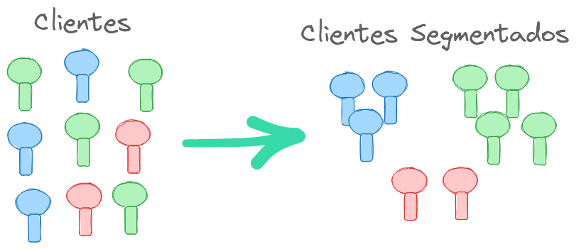
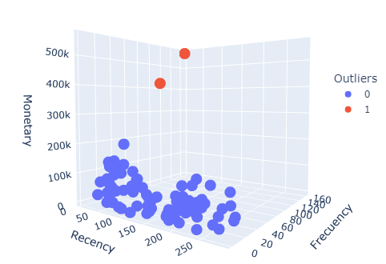
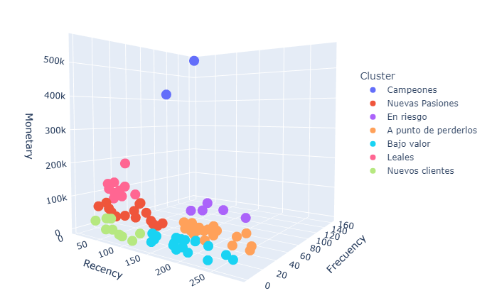

# Problema 3: Segmentación de clientes

La segmentación de clientes es el proceso mediante el cual se agrupan los clientes en base a su comportamiento, características y necesidades. Esto ayuda a las empresas de muchas maneras en el lanzamiento de un producto, destacando las propiedades del mismo, adaptándolas a cada grupo de consumidores. Además pueden apuntar a una audiencia específica a partir de su comportamiento. Todo lo anterior influye de forma directa en el valor de mercado de la empresa.

Algunas de las formas más comunes de segmentar a los usuarios son:

* Demográfica: Ejemplos -> edad, género, ingresos y educación.
* Geográfica: Ejemplos -> país, estado y ciudad.
* Comportamiento: Ejemplos -> hábitos, acciones frecuentes y uso de productos.

La segmentación de clientes es esencial para una empresa ya que aumenta los ingresos y mejora la satisfacción del cliente. Para un gerente de marketing directo, por ejemplo, resulta sumamente útil utilizar un sistema de inteligencia empresarial para informar sobre sus clientes. Al definir con precisión a sus mejores clientes basándose en parámetros como la Recency, Frecuency y Monetary Value (RFM), puede maximizar el retorno de la inversión en sus acciones de marketing. Un cliente que ordena con frecuencia, lo ha hecho recientemente y ha gastado una suma significativa de dinero es más probable que lo haga en el futuro que otros clientes.

Todo el procedimiento se encuentra detallado en el Jupyter Notebook. En este fichero solamente se plasman los puntos más destacados de la investigación.

Se estará trabajando con el dataset `sales_data_sample.csv` el cual contiene:

1. Información del pedido

    - `ORDERNUMBER`: Número de identificación de la orden.

    - `QUANTITYORDERED`: Cantidad de productos que se han ordenado.

    - `PRICEEACH`: Precio de cada producto.

    - `ORDERLINENUMBER`: Número de línea de la orden.

    - `SALES`: Ingresos generados por la venta.

    - `ORDERDATE`: Fecha y hora en que se realizó la orden.

    - `STATUS`: Estado del envío de la orden (ej. "Enviado").

    - `QTR_ID`: Identificador del trimestre del año en que se realizó la orden.

    - `MSRP`: Precio de venta sugerido por el fabricante.

    - `MONTH_ID`: Identificador del mes en que se realizó la orden.

    - `YEAR_ID`: Año en que se realizó la orden.
    
    - `DEALSIZE`: Tamaño de la transacción (ej. "Pequeño", "Mediano").
    

2. Información del cliente

    - `ADDRESSLINE1`: Primera línea de la dirección del cliente.

    - `ADDRESSLINE2`: Segunda línea de la dirección del cliente (puede estar vacía). 

    - `CITY`: Ciudad del cliente.

    - `STATE`: Estado o región del cliente.

    - `POSTALCODE`: Código postal del cliente.

    - `COUNTRY`: País del cliente.

    - `TERRITORY`: Territorio del cliente (puede estar vacío).

    - `CONTACTLASTNAME`: Apellido del contacto del cliente.

    - `CONTACTFIRSTNAME`: Nombre del contacto del cliente.

# Análisis RFM 

**RFM** es un método utilizado para segmentar a los clientes de un negocio según su valor. Sus siglas se originan de las siguientes variables, que son vitales para conocer el comportamiento de los consumidores.

¿Cuánto tiempo ha pasado desde que el cliente hizo su última orden? (**Recency**)

¿Cuántas veces ha ordenado en el último año? (**Frecuency**)

¿Cuál ha sido el valor total de los productos ordenados en ese año? (**Monetary Value**)

Esta puntuación es muy utilizada en campañas de marketing y ha recibido gran atención últimamente por las empresas porque la segmentación de sus clientes les permite tomar acciones hacia ellos más personalizadas.

En el Jupyter Notebook se le dan respuesta a estas interrogantes planteadas paso a paso.

## Visualizando los clientes outliers.

Estos outliers pueden llevarnos a una segmentación inadecuada porque el comportamiento de esos dos clientes es muy diferente con respecto al de la mayoría. Son los que más compran, visitan y los que aportan mayores ganancias; representando el 19% de las ventas obtenidas el último año. A ellos hay que brindarles atención diferenciada. Y su comportamiento debe ser estudiado a detalle para  que más consumidores los sigan. 

## Construcción del modelo de Segmentación de Clientes

Se selecciona el algoritmo **K-Means** porque es  **unsupervised** (no supervisado) y el mismo es utilizado cuando tenemos datos sin etiquetar como es en nuestro caso. Este algoritmo descubre grupos (clústeres) en los datos donde el número de clústeres es representado por el valor de K, es por ello que es adecuado para los problemas de segmentación de clientes.

Después de incorporar los clústeres obtenidos a través de este algoritmo se procede a hacer un resumen de los resultados para conocer mejor a nuestros clientes.
 	
|Cluster|	 MeanRecency|	MeanFrecuency|	MeanMonetary|	MeanRFM	|CantidadClientes|
|- 	    |-              |-               |-             |-          |-              |	 
|0|	196.11|	6.05|	20806.35|	1.74|	19|
|1|	215.80|	27.60|	97627.51|	3.87|	5|
|2|	26.10|	32.20|	114205.23|	4.93|	10|
|3|	225.40|	15.00|	53097.00|	2.72|	20|
|4|	84.67|	16.33|	59786.37|	3.58|	15|
|5|	73.33|	4.78|	19957.20|	2.26|	9|
|6|	3.00|	137.50|	494031.57|	5.00|	2|

**Datos más destacados de cada clúster:**

* **Cluster 0: (Bajo valor)**: Son clientes que compran esporádicamente y cuando lo hacen son ofertas de bajo valor. Se recomienda no dedicarle esfuerzo a este grupo, pues forman parte del churn rate natural de cada empresa.

* **Cluster 1: (En riesgo)**: Son clientes que compraban seguido gastando grandes cantidades, pero no han realizado compras recientemente. Se recomienda enviarles una campaña personalizada para reconectar y ofrecerles productos que puedan contribuir a que realicen otra compra.

* **Cluster 2: (Leales)**: No han comprado tan recientemente como los campeones, pero cuando lo hacen aportan grandes ingresos a las ventas de la empresa. Se recomienda escuchar su opinión sobre la empresa, productos y servicios que la misma brinda y presentarle ofertas tentadoras para convertirlos en los próximos campeones.

* **Cluster 3: (A punto de perderlos)**: Son clientes que compraban y visitaban la empresa seguido, pero no han realizado compras recientemente. Se recomienda traerlos de vuelta con promociones y pedirles que llenen encuestas para conocer la razón del por qué ya no nos visitan y evitar perderlos ante la competencia.

* **Cluster 4: (Nuevas Pasiones)**: Son el grupo de nuevos clientes que poseen el más alto valor monetario de los que recién comienzan. Si son tratados bien pueden convertirse en los próximos **campeones** o **clientes leales**. La clave con ellos es conocerlos mejor e incentivarlos a comprar.

* **Cluster 5: (Nuevos clientes)**: Son los clientes que tienen una buena puntuación **RFM** pero no son compradores frecuentes. Se recomienda comenzar a construir relaciones con ellos brindándoles apoyo y ofertas especiales para incrementar sus visitas. 

* **Cluster 6: (Campeones)**: Los clientes de este grupo son los mejores clientes, los que más recientemente compraron, más seguido y son los de mayor valor monetario. Se recomienda darle recompensas a este grupo, ofrecerle planes donde sean los primeros en adquirir los productos más novedosos de la empresa y se vuelvan promotores de la marca.

## Gráfico de apoyo al equipo de marketing.

Se procede a renombrar los clústeres con los nuevos nombres según la descripción de cada uno.

# Conclusiones

Proveer a todos los clientes con el mismo modelo de producto, email, mensajes de texto o anuncios no es lo ideal. Los usuarios tienen diferentes necesidades y un mismo acercamiento hacia ellos resultará en bajo compromiso, baja tasa de clicks y en pocas ventas. La segmentación de clientes es la solución para este problema.

Encontrar el óptimo número de grupos de consumidores nos permitió entender las diferencias entre ellos en los hábitos de compra y nos ayudará en darle exactamente lo que desean de una forma más personalizada. Esta segmentación de los usuarios mejorará la experiencia de ellos e incrementa las ganancias de la empresa.